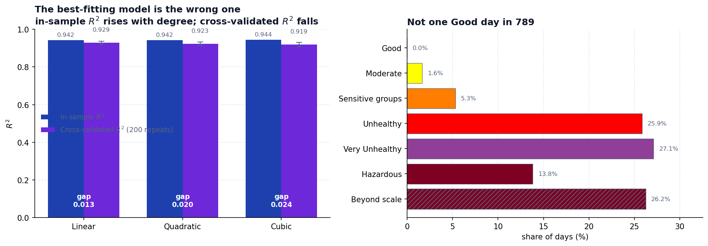

# Delhi Air Quality

Polynomial regression, exponential regression and Simpson's rule applied to 18,776 hourly
pollution readings from Delhi. The interesting result is not which model fits best — it is
that the model which *looks* best is the one you should throw away.



## What it found

**The best-fitting model is the wrong one.** Fitting CO against PM2.5 with polynomials of
increasing degree, the cubic scores the highest R² — 0.9437 against the linear model's
0.9423. In-sample R² cannot fall when you add a term, so that ranking was never evidence of
anything. Under cross-validation the order inverts:

| Model | In-sample R² | Cross-validated R² | Gap |
|---|---|---|---|
| **Linear** | 0.9423 | **0.929 ± 0.008** | 0.013 |
| Quadratic | 0.9423 | 0.923 ± 0.010 | 0.020 |
| Cubic | **0.9437** | 0.919 ± 0.012 | 0.024 |

Cross-validated figures are means over 200 repeats of 5-fold CV. Linear scores best in 99%
of them. The cubic is not better; it is memorising 58 points.

**The cubic's headline prediction is a solver failure, not a prediction.** Asked what CO
level would bring PM2.5 to the 15 µg/m³ safe threshold, it returns −350.51 µg/m³. That is
not a negative-concentration *result*: the root-finder reports it failed to converge, and
the returned value leaves a residual of 1.84 — it is not a root at all. The linear and
quadratic models answer at 658 and 656 µg/m³.

**The two R² values answer different questions.** Fitting the 58 fortnightly means scores
0.942; fitting all 18,776 hourly rows scores 0.878. The tempting explanation — averaging
removes noise — is testable and wrong. Averaging the same rows into 58 *random* groups of
identical sizes scores 0.871, back at the hourly figure. The gain comes from aggregating
over time: most PM2.5 variance sits within a fortnight, where CO co-varies weakly, and
averaging discards exactly that part.

**Not one Good day.** Across 789 days the record contains no day in the EPA's Good category,
and 26.2% of days sit above the top of the scale entirely, where the EPA defines no index.

**The cycles the averaging erased.** Winter runs 3.3× the monsoon months. The daily cycle
peaks at 22:30 IST and troughs at 14:30 IST, a 2.9× swing — invisible in a fortnightly mean.

## Running it

Requires Python 3.9+ and, for the site, Node 18+.

```bash
python3 -m venv env
source env/bin/activate          # Windows: env\Scripts\activate
python3 -m pip install -r requirements.txt
```

Reproduce the analysis:

```bash
python3 analysis/validation.py
```

Prints the model comparison, the conditioning check, the aggregation placebo test and the
repeated cross-validation. Takes about a minute — the placebo test fits 200 models.

```bash
cd analysis && python3 seasonality.py
```

Prints the seasonal and daily profiles and the AQI category distribution.

```bash
cd PolynomialRegression && python3 main.py     # the three fits and their predictions
cd PolynomialRegression && python3 analysis.py # model comparison
```

The three notebooks (`dataConverter.ipynb`, `ExponentialRegression/`, `SimpsonsMethod/`) run
top to bottom in a clean kernel:

```bash
python3 -m jupyter notebook
```

Regenerate everything the site reads, plus the figure above:

```bash
python3 analysis/export_results.py
python3 analysis/make_figure.py
```

`export_results.py` re-derives every published figure and fails loudly if any of them has
moved from the value this README quotes.

Run the site:

```bash
cd web && npm install && npm run dev
```

## Layout

| Path | What it is |
|---|---|
| `Data/` | The dataset and its licence — read `Data/README.md` before reusing it |
| `analysis/` | AQI, validation, seasonality, and the export that feeds the site |
| `PolynomialRegression/` | Linear, quadratic and cubic fits by normal equation |
| `ExponentialRegression/` | Exponential fitting against each pollutant |
| `SimpsonsMethod/` | Composite Simpson's rule for cumulative exposure |
| `web/` | The static site |

## Limitations

- **Correlation, not causation.** CO predicts PM2.5 well because both come largely from
  combustion. Reducing CO would not mechanically reduce PM2.5.
- **The safe-threshold figures are extrapolation.** The 15 µg/m³ target sits far below
  anything observed; the lowest fortnightly mean in the record is 77 µg/m³.
- **"The cubic overfits" is a claim about 58 points.** On the full hourly series the gap
  collapses and the cubic very slightly wins on cross-validation. With enough data the degree
  stops mattering.
- **The cubic normal equation is poorly conditioned** (cond(XᵀX) ≈ 10²⁴). It still agrees
  with a least-squares solve to 2×10⁻⁹ relative, so the reported R² is sound — but the method
  has no margin left, and centring the predictor would remove the risk.
- **The timezone is inferred**, not documented by the source. It is deduced from the shape of
  the daily cycle: read as stored, the cycle peaks and troughs at implausible times for a city.
- **One city, 26 months**, from a dataset that does not document its monitoring stations.
- **Simpson's cumulative exposure is reported for complete years only.** With a fixed interval
  axis the integral works out at roughly five times the annual mean, so it carries no more
  information than the mean does.

## Contributors

Akshita Goel (Simpson's method), Morenzo MinarWidjaja (polynomial regression), Savan Patel
(data pipeline, exponential regression, and the validation, AQI and seasonality analysis).

## Licence

Code is MIT — see `LICENSE`.

The data is **not**. `Data/` is redistributed from
[a Kaggle dataset](https://www.kaggle.com/datasets/deepaksirohiwal/delhi-air-quality) under
**CC BY-NC-SA 4.0**: attribution required, non-commercial only, share-alike. The derived
fortnightly file inherits those terms. See `Data/README.md`.
